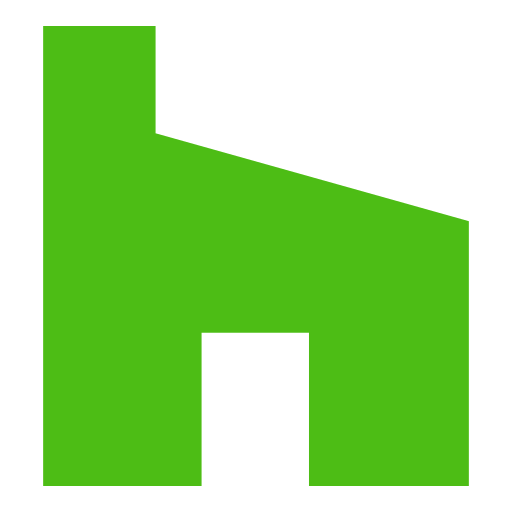

<p align="center">
  
</p>

<h1 align="center">
  Vue Socials
</h1>

<p align="center">
  Social media share buttons and counts for <a href="https://vuejs.org/">Vue.js</a>.
  <br>
  <a href="https://vue-socials.vercel.app/"><strong>Explore website »</strong></a>
</p>

<br>

<p align="center">
  <a href="https://npmjs.org/package/vue-socials">
    
</a>
  <a href="https://npmjs.org/package/reakit">

</a>
 <a href="https://github.com/webistomin/vue-socials">

</a>
 <a href="https://github.com/webistomin/vue-socials">
  
</a>
 <a href="https://github.com/webistomin/vue-socials">
    
</a>
<a href="https://bundlephobia.com/result?p=vue-socials">
  
  </a>
</p>

<p align="center">
  <a href="#key-features-">Key Features</a> •
  <a href="#documentation-">Documentation</a> •
  <a href="#browsers-support-">Browsers support</a> •
  <a href="#license-">License</a>  •
  <a href="#support-the-project-">Support the project</a>  •
  <a href="#contributing-">Contributing</a>
</p>

## Key Features ✨

* **50+** reusable components
* **Small** `~7KB` (minified and gzipped)
* Fully **tree-shakeable**
* **No dependencies**
* **No SDK**
* **Don't track** the user

## Documentation 🤗

Browse [online documentation here](https://vue-socials.vercel.app/)

### Socials

### B

*  [Blogger](#sblogger)

### D

*  [DevTo](#sdevto)

*  [Diaspora](#sdiaspora)

*  [Douban](#sdouban)

### E

*  [Email](#semail)

*  [Evernote](#severnote)

### F

*  [Facebook](#sfacebook)
  
  *  [Facebook counter](#sfacebookcount)

*  [Facebook Messenger](#sfacebookmessenger)

*  [Facebook Workplace](#sfacebookworkplace)

*  [Flipboard](#sflipboard)

### G

*  [Github](#sgithub)

  *  [Github counter](#sgithubcount)

*  [Github gist](#sgithubgist)

  *  [Github gist counter](#sgithubgistcount) 

*  [Github repository](#sgithubgist)

  *  [Github repository counter](#sgithubrepositorycount)   

*  [Gmail](#sgmail)

*  [Google Bookmarks](#sgooglebookmarks)

### H

*  [Hacker News](#shackernews)

*  [Hatena](#shatena)

*  [Houzz](#shouzz)

### I

*  [Instapaper](#sinstapaper)

## K

*  [Kakao Story](#skakaostory)

## L

*  [Line](#sline)

*  [Linkedin](#slinkedin)

*  [LiveJournal](#slivejournal)

## M

*  [MailRu](#smailru)

*  [Microsoft Teams](#smicrosoftteams)

## O

*  [Odnoklassniki](#sodnoklassniki)

## P

*  [Pinterest](#spinterest)

*  [Pocket](#spocket)

## Q

*  [Qzone](#sqzone)

## R

*  [Reddit](#sreddit)

*  [Renren](#srenren)

## S

*  [Skype](#sskype)

*  [Sms](#ssms)

## T

*  [Telegram](#stelegram)

*  [Threema](#sthreema)

*  [Trello](#strello)

*  [Tumblr](#stumblr)

*  [Twitter](#stwitter)

## V

*  [Viber](#sviber)

*  [Vkontakte](#svkontakte)

## W

*  [Weibo](#sweibo)

*  [Whatsapp](#swhatsapp)

*  [Wordpress](#swordpress)

## X

*  [Xing](#sxing)

## Y

*  [Yahoo](#syahoo)

*  [Yammer](#syammer)

---

### SBlogger

**Usage**

```vue
<template>
  <s-blogger
    :window-features="windowFeatures"
    :share-options="shareOptions"
    :use-native-behavior="useNativeBehavior"
    @popup-close="onClose"
    @popup-open="onOpen"
    @popup-block="onBlock"
    @popup-focus="onFocus"
  ></s-blogger>
</template>

<script>
  import { SBlogger } from 'vue-socials'

  export default {
    name: 'SBloggerSharing',
    
    components: { SBlogger },
    
    data() {
      return {
        windowFeatures: {},
        shareOptions: { 
          url: 'https://github.com/', 
          title: 'Title', 
          text: 'Text',
        },
        useNativeBehavior: false,
      }
    },
    
    methods: {
      onClose() {},
      onOpen() {},
      onBlock() {},
      onFocus() {},
    }
  };
</script>
```

**Props**

| Prop | Type | Description | Default value |
| ------ | ------ | ------ | ------ |
`windowFeatures` | `object` | Pass options to `window.open()`. [Requested features of the new window.](https://developer.mozilla.org/en-US/docs/Web/API/Window/open#window_features) | `{ width: 600, height: 540, }`
`shareOptions` | `object` | Your share link parameters: <br /> **url** – the URL you want to share <br /> **title** – your blogpost title  <br /> **text** – your blogpost content <br /> <br />```{ url: 'https://github.com/', title: 'Title', text: 'Text', } ``` | `{}`
`useNativeBehavior` | `boolean` | Use native link behavior instead of `window.open()` or not | `false`

**Events**

| Event name | Usage |
| ------ | ------ |
`popup-open` | `window.open()` has been opened |
`popup-close` | `window.open()` has been closed |
`popup-block` | `window.open()` has been blocked |
`popup-focus` | `window.open()` has been focused |

---

### SDevTo

**Usage**

```vue
<template>
  <s-dev-to
    :window-features="windowFeatures"
    :share-options="shareOptions"
    :use-native-behavior="useNativeBehavior"
    @popup-close="onClose"
    @popup-open="onOpen"
    @popup-block="onBlock"
    @popup-focus="onFocus"
  ></s-dev-to>
</template>

<script>
  import { SDevTo } from 'vue-socials'

  export default {
    name: 'SDevToSharing',
    
    components: { SDevTo },
    
    data() {
      return {
        windowFeatures: {},
        shareOptions: {
          title: 'Title',
          isPublished: false,
          tags: ['tag', 'tag2'],
          content: 'Text 1\nText 2\n',
        },
        useNativeBehavior: false,
      }
    },
    
    methods: {
      onClose() {},
      onOpen() {},
      onBlock() {},
      onFocus() {},
    }
  };
</script>
```

**Props**

| Prop | Type | Description | Default value |
| ------ | ------ | ------ | ------ |
`windowFeatures` | `object` | Pass options to `window.open()`. [Requested features of the new window.](https://developer.mozilla.org/en-US/docs/Web/API/Window/open#window_features) | `{ width: 600, height: 540, }`
`shareOptions` | `object` | Your share link parameters: <br /> **title** – your blogpost title <br /> **isPublished** – is your blogpost published <br /> **tags** – hashtags for blogpost <br /> **content** – your blogpost content <br /> <br /> ```{ title: 'Title', isPublished: false, tags: ['tag', 'tag2'], content: 'Text 1\nText 2\n',}``` | `{}`
`useNativeBehavior` | `boolean` | Use native link behavior instead of `window.open()` or not | `false`

**Events**

| Event name | Usage |
| ------ | ------ |
`popup-open` | `window.open()` has been opened |
`popup-close` | `window.open()` has been closed |
`popup-block` | `window.open()` has been blocked |
`popup-focus` | `window.open()` has been focused |

---

### SDiaspora

**Usage**

```vue
<template>
  <s-diaspora
    :window-features="windowFeatures"
    :share-options="shareOptions"
    :use-native-behavior="useNativeBehavior"
    @popup-close="onClose"
    @popup-open="onOpen"
    @popup-block="onBlock"
    @popup-focus="onFocus"
  ></s-diaspora>
</template>

<script>
  import { SDiaspora } from 'vue-socials'

  export default {
    name: 'SDiasporaSharing',
    
    components: { SDiaspora },
    
    data() {
      return {
        windowFeatures: {},
        shareOptions: {
          url: 'https://github.com/',
          title: 'Title',
        },
        useNativeBehavior: false,
      }
    },
    
    methods: {
      onClose() {},
      onOpen() {},
      onBlock() {},
      onFocus() {},
    }
  };
</script>
```

**Props**

| Prop | Type | Description | Default value |
| ------ | ------ | ------ | ------ |
`windowFeatures` | `object` | Pass options to `window.open()`. [Requested features of the new window.](https://developer.mozilla.org/en-US/docs/Web/API/Window/open#window_features) | `{ width: 600, height: 540, }`
`shareOptions` | `object` | Your share link parameters: <br /> **url** – the URL you want to share <br />**title** – your blogpost title <br /> <br /> ```{ url: 'https://github.com/', title: 'Title', }``` | `{}`
`useNativeBehavior` | `boolean` | Use native link behavior instead of `window.open()` or not | `false`

**Events**

| Event name | Usage |
| ------ | ------ |
`popup-open` | `window.open()` has been opened |
`popup-close` | `window.open()` has been closed |
`popup-block` | `window.open()` has been blocked |
`popup-focus` | `window.open()` has been focused |

---

### SDouban

**Usage**

```vue
<template>
  <s-douban
    :window-features="windowFeatures"
    :share-options="shareOptions"
    :use-native-behavior="useNativeBehavior"
    @popup-close="onClose"
    @popup-open="onOpen"
    @popup-block="onBlock"
    @popup-focus="onFocus"
  ></s-douban>
</template>

<script>
  import { SDouban } from 'vue-socials'

  export default {
    name: 'SDoubanSharing',
    
    components: { SDouban },
    
    data() {
      return {
        windowFeatures: {},
        shareOptions: {
          url: 'https://github.com/',
          title: 'Title',
        },
        useNativeBehavior: false,
      }
    },
    
    methods: {
      onClose() {},
      onOpen() {},
      onBlock() {},
      onFocus() {},
    }
  };
</script>
```

**Props**

| Prop | Type | Description | Default value |
| ------ | ------ | ------ | ------ |
`windowFeatures` | `object` | Pass options to `window.open()`. [Requested features of the new window.](https://developer.mozilla.org/en-US/docs/Web/API/Window/open#window_features) | `{ width: 1100, height: 450, }`
`shareOptions` | `object` | Your share link parameters: <br /> **url** – the URL you want to share <br />**title** – your blogpost title <br /> <br /> ```{ url: 'https://github.com/', title: 'Title', }``` | `{}`
`useNativeBehavior` | `boolean` | Use native link behavior instead of `window.open()` or not | `false`

**Events**

| Event name | Usage |
| ------ | ------ |
`popup-open` | `window.open()` has been opened |
`popup-close` | `window.open()` has been closed |
`popup-block` | `window.open()` has been blocked |
`popup-focus` | `window.open()` has been focused |

---

### SEmail

**Usage**

```vue
<template>
  <s-email :share-options="shareOptions"></s-email>
</template>

<script>
  import { SEmail } from 'vue-socials'

  export default {
    name: 'SEmailSharing',
    
    components: { SEmail },
    
    data() {
      return {
        shareOptions: {
          mail: 'google@gmail.com',
          cc: ['google1@gmail.com', 'google3@gmail.com'],
          bcc: ['google2@gmail.com', 'google4@gmail.com'],
          subject: 'Subject',
          body: 'Hello\nWorld',
        },
      }
    },
  };
</script>
```

**Props**

| Prop | Type | Description | Default value |
| ------ | ------ | ------ | ------ |
`shareOptions` | `object` | Your share link parameters: <br /> **mail** – e-mail recipient address <br /> **subject** – subject of e-mail <br /> **cc** – carbon copy e-mail address <br />  **bcc** – blind carbon copy e-mail address <br /> **body** – body of e-mail <br /> <br /> ```{ mail: 'google@gmail.com', cc: ['google1@gmail.com', 'google3@gmail.com'], bcc: ['google2@gmail.com', 'google4@gmail.com'], subject: 'Subject', body: 'Hello\nWorld', }``` | `{}`

---

### SEvernote

**Usage**

```vue
<template>
  <s-evernote
    :window-features="windowFeatures"
    :share-options="shareOptions"
    :use-native-behavior="useNativeBehavior"
    @popup-close="onClose"
    @popup-open="onOpen"
    @popup-block="onBlock"
    @popup-focus="onFocus"
  ></s-evernote>
</template>

<script>
  import { SEvernote } from 'vue-socials'

  export default {
    name: 'SEvernoteSharing',
    
    components: { SEvernote },
    
    data() {
      return {
        windowFeatures: {},
        shareOptions: {
          url: 'https://github.com/',
          title: 'Title',
        },
        useNativeBehavior: false,
      }
    },
    
    methods: {
      onClose() {},
      onOpen() {},
      onBlock() {},
      onFocus() {},
    }
  };
</script>
```

**Props**

| Prop | Type | Description | Default value |
| ------ | ------ | ------ | ------ |
`windowFeatures` | `object` | Pass options to `window.open()`. [Requested features of the new window.](https://developer.mozilla.org/en-US/docs/Web/API/Window/open#window_features) | `{ width: 800, height: 560, }`
`shareOptions` | `object` | Your share link parameters: <br /> **url** – the URL you want to share <br />**title** – your blogpost title <br /> <br /> ```{ url: 'https://github.com/', title: 'Title', }``` | `{}`
`useNativeBehavior` | `boolean` | Use native link behavior instead of `window.open()` or not | `false`

**Events**

| Event name | Usage |
| ------ | ------ |
`popup-open` | `window.open()` has been opened |
`popup-close` | `window.open()` has been closed |
`popup-block` | `window.open()` has been blocked |
`popup-focus` | `window.open()` has been focused |

---

### SFacebook

**Usage**

```vue
<template>
  <s-facebook
    :window-features="windowFeatures"
    :share-options="shareOptions"
    :use-native-behavior="useNativeBehavior"
    @popup-close="onClose"
    @popup-open="onOpen"
    @popup-block="onBlock"
    @popup-focus="onFocus"
  ></s-facebook>
</template>

<script>
  import { SFacebook } from 'vue-socials'

  export default {
    name: 'SFacebookSharing',
    
    components: { SFacebook },
    
    data() {
      return {
        windowFeatures: {},
        shareOptions: {
          url: 'https://github.com/',
          quote: 'Quote',
          hashtag: '#Github',
        },
        useNativeBehavior: false,
      }
    },
    
    methods: {
      onClose() {},
      onOpen() {},
      onBlock() {},
      onFocus() {},
    }
  };
</script>
```

**Props**

| Prop | Type | Description | Default value |
| ------ | ------ | ------ | ------ |
`windowFeatures` | `object` | Pass options to `window.open()`. [Requested features of the new window.](https://developer.mozilla.org/en-US/docs/Web/API/Window/open#window_features) | `{ width: 685, height: 600, }`
`shareOptions` | `object` | Your share link parameters: <br /> **url** – the URL you want to share <br /> **quote** – your blogpost quote <br /> **hashtag** – your blogpost hashtag <br /> <br /> ```{ url: 'https://github.com/', quote: 'Quote', hashtag: '#Github', }``` | `{}`
`useNativeBehavior` | `boolean` | Use native link behavior instead of `window.open()` or not | `false`

**Events**

| Event name | Usage |
| ------ | ------ |
`popup-open` | `window.open()` has been opened |
`popup-close` | `window.open()` has been closed |
`popup-block` | `window.open()` has been blocked |
`popup-focus` | `window.open()` has been focused |

---

### SFacebookCount

**Usage**

```vue
<template>
  <s-facebook-count
    :share-options="shareOptions"
    @load="onLoad"
    @error="onError"
    @loading="onLoading"
  ></s-facebook-count>
</template>

<script>
  import { SFacebookCount } from 'vue-socials'

  export default {
    name: 'SFacebookCountSharing',
    
    components: { SFacebookCount },
    
    data() {
      return {
        tag: 'span',
        shareOptions: {
          id: 'https://github.com/',
          fields: ['id', 'og_object'],
          accessToken: '',
        },
      }
    },
    
    methods: {
      onLoad() {},
      onError() {},
      onLoading() {},
    }
  };
</script>
```

**Props**

| Prop | Type | Description | Default value |
| ------ | ------ | ------ | ------ |
`shareOptions` | `object` | Your share link parameters: <br /> **id** – the URL you want to share <br /> **accessToken** – your facebook access token <br /> **fields** – a comma-separated list of fields you want to request. <br /> <br /> ```{ id: 'https://github.com/', fields: ['id', 'og_object'], accessToken: '', }``` | `{}`
`tag` | `string` | Dynamic HTML tag or component  | `span`

**Events**

| Event name | Usage |
| ------ | ------ |
`load` |  the request has finished successfully | 
`error` | the request has finished with error |
`loading` | the request has started |

**⚠️ Warning**

This component uses `JSONP` so the content won't be available during `SSR`.

---

### SFacebookMessenger

**Usage**

```vue
<template>
  <s-facebook-messenger
    :window-features="windowFeatures"
    :share-options="shareOptions"
    :use-native-behavior="useNativeBehavior"
    @popup-close="onClose"
    @popup-open="onOpen"
    @popup-block="onBlock"
    @popup-focus="onFocus"
  ></s-facebook-messenger>
</template>

<script>
  import { SFacebookMessenger } from 'vue-socials'

  export default {
    name: 'SFacebookMessengerSharing',
    
    components: { SFacebookMessenger },
    
    data() {
      return {
        windowFeatures: {},
        shareOptions: {
          url: 'https://github.com/',
          redirectUri: 'https://www.domain.com/',
          appId: 123456789,
          to: undefined,
        },
        useNativeBehavior: false,
      }
    },
    
    methods: {
      onClose() {},
      onOpen() {},
      onBlock() {},
      onFocus() {},
    }
  };
</script>
```

**Props**

| Prop | Type | Description | Default value |
| ------ | ------ | ------ | ------ |
`windowFeatures` | `object` | Pass options to `window.open()`. [Requested features of the new window.](https://developer.mozilla.org/en-US/docs/Web/API/Window/open#window_features) | `{ width: 685, height: 600, }`
`shareOptions` | `object` | Your share link parameters: <br /> **url** – the URL you want to share <br /> **redirectUri** – The URL to redirect to after a person clicks a button on the dialog. <br /> **appId** – Your app's unique identifier. <br />  **to** – A user ID of a recipient. Once the dialog comes up, the sender can specify additional people as recipients. <br /> <br /> ```url: 'https://github.com/', redirectUri: 'https://www.domain.com/', appId: 123456789, to: undefined,``` | `{}`
`useNativeBehavior` | `boolean` | Use native link behavior instead of `window.open()` or not | `false`

**Events**

| Event name | Usage |
| ------ | ------ |
`popup-open` | `window.open()` has been opened |
`popup-close` | `window.open()` has been closed |
`popup-block` | `window.open()` has been blocked |
`popup-focus` | `window.open()` has been focused |

---

### SFacebookWorkplace

**Usage**

```vue
<template>
  <s-facebook-workplace
    :window-features="windowFeatures"
    :share-options="shareOptions"
    :use-native-behavior="useNativeBehavior"
    @popup-close="onClose"
    @popup-open="onOpen"
    @popup-block="onBlock"
    @popup-focus="onFocus"
  ></s-facebook-workplace>
</template>

<script>
  import { SFacebookWorkplace } from 'vue-socials'

  export default {
    name: 'SFacebookWorkplaceSharing',
    
    components: { SFacebookWorkplace },
    
    data() {
      return {
        windowFeatures: {},
        shareOptions: {
          url: 'https://github.com/',
        },
        useNativeBehavior: false,
      }
    },
    
    methods: {
      onClose() {},
      onOpen() {},
      onBlock() {},
      onFocus() {},
    }
  };
</script>
```

**Props**

| Prop | Type | Description | Default value |
| ------ | ------ | ------ | ------ |
`windowFeatures` | `object` | Pass options to `window.open()`. [Requested features of the new window.](https://developer.mozilla.org/en-US/docs/Web/API/Window/open#window_features) | `{ width: 685, height: 600, }`
`shareOptions` | `object` | Your share link parameters: <br /> **url** – the URL you want to share <br /> <br /> ```{ url: 'https://github.com/', }``` | `{}`
`useNativeBehavior` | `boolean` | Use native link behavior instead of `window.open()` or not | `false`

**Events**

| Event name | Usage |
| ------ | ------ |
`popup-open` | `window.open()` has been opened |
`popup-close` | `window.open()` has been closed |
`popup-block` | `window.open()` has been blocked |
`popup-focus` | `window.open()` has been focused |

---

### SFlipBoard

**Usage**

```vue
<template>
  <s-flip-board
    :window-features="windowFeatures"
    :share-options="shareOptions"
    :use-native-behavior="useNativeBehavior"
    @popup-close="onClose"
    @popup-open="onOpen"
    @popup-block="onBlock"
    @popup-focus="onFocus"
  ></s-flip-board>
</template>

<script>
  import { SFlipBoard } from 'vue-socials'

  export default {
    name: 'SFlipBoardSharing',
    
    components: { SFlipBoard },
    
    data() {
      return {
        windowFeatures: {},
        shareOptions: {
          url: 'https://github.com/',
          title: 'Title',
        },
        useNativeBehavior: false,
      }
    },
    
    methods: {
      onClose() {},
      onOpen() {},
      onBlock() {},
      onFocus() {},
    }
  };
</script>
```

**Props**

| Prop | Type | Description | Default value |
| ------ | ------ | ------ | ------ |
`windowFeatures` | `object` | Pass options to `window.open()`. [Requested features of the new window.](https://developer.mozilla.org/en-US/docs/Web/API/Window/open#window_features) | `{ width: 834, height: 572, }`
`shareOptions` | `object` | Your share link parameters: <br /> **url** – the URL you want to share <br />**title** – your blogpost title <br /> <br /> ```{ url: 'https://github.com/', title: 'Title', }``` | `{}`
`useNativeBehavior` | `boolean` | Use native link behavior instead of `window.open()` or not | `false`

**Events**

| Event name | Usage |
| ------ | ------ |
`popup-open` | `window.open()` has been opened |
`popup-close` | `window.open()` has been closed |
`popup-block` | `window.open()` has been blocked |
`popup-focus` | `window.open()` has been focused |

---

### SGithub

**Usage**

```vue
<template>
  <s-github
    :window-features="windowFeatures"
    :share-options="shareOptions"
    :use-native-behavior="useNativeBehavior"
    @popup-close="onClose"
    @popup-open="onOpen"
    @popup-block="onBlock"
    @popup-focus="onFocus"
  ></s-github>
</template>

<script>
  import { SGithub } from 'vue-socials'

  export default {
    name: 'SSGithubSharing',
    
    components: { SGithub },
    
    data() {
      return {
        windowFeatures: {},
        shareOptions: {
          username: 'webistomin',
          type: 'profile',
        },
        useNativeBehavior: false,
      }
    },
    
    methods: {
      onClose() {},
      onOpen() {},
      onBlock() {},
      onFocus() {},
    }
  };
</script>
```

**Props**

| Prop | Type | Description | Default value |
| ------ | ------ | ------ | ------ |
`windowFeatures` | `object` | Pass options to `window.open()`. [Requested features of the new window.](https://developer.mozilla.org/en-US/docs/Web/API/Window/open#window_features) | `{ width: 834, height: 572, }`
`shareOptions` | `object` | Your share link parameters: <br /> **username** – your GitHub username <br /> **type** – share link type (sponsor, follow, profile) <br /> <br /> ```username: 'webistomin', type: 'profile',``` | `{}`
`useNativeBehavior` | `boolean` | Use native link behavior instead of `window.open()` or not | `false`

**Events**

| Event name | Usage |
| ------ | ------ |
`popup-open` | `window.open()` has been opened |
`popup-close` | `window.open()` has been closed |
`popup-block` | `window.open()` has been blocked |
`popup-focus` | `window.open()` has been focused |

---

### SGithubCount

**Usage**

```vue
<template>
  <s-github-count
    :share-options="shareOptions"
    @load="onLoad"
    @error="onError"
    @loading="onLoading"
  ></s-github-count>
</template>

<script>
  import { SGithubCount } from 'vue-socials'

  export default {
    name: 'SGithubCountSharing',
    
    components: { SGithubCount },
    
    data() {
      return {
        tag: 'span',
        shareOptions: {
          username: 'webistomin',
          type: 'follow',
        },
      }
    },
    
    methods: {
      onLoad() {},
      onError() {},
      onLoading() {},
    }
  };
</script>
```

**Props**

| Prop | Type | Description | Default value |
| ------ | ------ | ------ | ------ |
`shareOptions` | `object` | Your share link parameters: <br /> **username** – your GitHub username <br /> **type** – share link type (follow) <br /> <br /> ```{ id: 'https://github.com/', fields: ['id', 'og_object'], accessToken: '', }``` | `{}`
`tag` | `string` | Dynamic HTML tag or component  | `span`

**Events**

| Event name | Usage |
| ------ | ------ |
`load` |  the request has finished successfully | 
`error` | the request has finished with error |
`loading` | the request has started |

**⚠️ Warning**

This component uses `JSONP` so the content won't be available during `SSR`.

---

### SGithubGist

**Usage**

```vue
<template>
  <s-github-gist
    :window-features="windowFeatures"
    :share-options="shareOptions"
    :use-native-behavior="useNativeBehavior"
    @popup-close="onClose"
    @popup-open="onOpen"
    @popup-block="onBlock"
    @popup-focus="onFocus"
  ></s-github-gist>
</template>

<script>
  import { SGithubGist } from 'vue-socials'

  export default {
    name: 'SSGithubGistSharing',
    
    components: { SGithubGist },
    
    data() {
      return {
        windowFeatures: {},
        shareOptions: {
          username: 'ai',
          gistId: 'e3683b03ba936ade91d33dbc721cd6d8',
          type: 'star',
        },
        useNativeBehavior: false,
      }
    },
    
    methods: {
      onClose() {},
      onOpen() {},
      onBlock() {},
      onFocus() {},
    }
  };
</script>
```

**Props**

| Prop | Type | Description | Default value |
| ------ | ------ | ------ | ------ |
`windowFeatures` | `object` | Pass options to `window.open()`. [Requested features of the new window.](https://developer.mozilla.org/en-US/docs/Web/API/Window/open#window_features) | `{ width: 834, height: 572, }`
`shareOptions` | `object` | Your share link parameters: <br /> **username** – your gist username <br /> **gistId** – your gist id <br /> **type** – share link type (gist, star, fork, download) <br /> <br /> ```{ username: 'ai', gistId: 'e3683b03ba936ade91d33dbc721cd6d8', type: 'star', }``` | `{}`
`useNativeBehavior` | `boolean` | Use native link behavior instead of `window.open()` or not | `false`

**Events**

| Event name | Usage |
| ------ | ------ |
`popup-open` | `window.open()` has been opened |
`popup-close` | `window.open()` has been closed |
`popup-block` | `window.open()` has been blocked |
`popup-focus` | `window.open()` has been focused |

---

### SGithubGistCount

**Usage**

```vue
<template>
  <s-github-gist-count
    :share-options="shareOptions"
    @load="onLoad"
    @error="onError"
    @loading="onLoading"
  ></s-github-gist-count>
</template>

<script>
  import { SGithubGistCount } from 'vue-socials'

  export default {
    name: 'SGithubGistCountSharing',
    
    components: { SGithubGistCount },
    
    data() {
      return {
        tag: 'span',
        shareOptions: {
          gistId: 'e3683b03ba936ade91d33dbc721cd6d8',
          type: 'fork',
        },
      }
    },
    
    methods: {
      onLoad() {},
      onError() {},
      onLoading() {},
    }
  };
</script>
```

**Props**

| Prop | Type | Description | Default value |
| ------ | ------ | ------ | ------ |
`shareOptions` | `object` | Your share link parameters: <br /> **gistId** – your gist id <br /> **type** – share link type (fork) <br /> <br /> ```{ gistId: 'e3683b03ba936ade91d33dbc721cd6d8', type: 'fork', }``` | `{}`
`tag` | `string` | Dynamic HTML tag or component  | `span`

**Events**

| Event name | Usage |
| ------ | ------ |
`load` |  the request has finished successfully | 
`error` | the request has finished with error |
`loading` | the request has started |

**⚠️ Warning**

This component uses `JSONP` so the content won't be available during `SSR`.

---

### SGithubRepo

**Usage**

```vue
<template>
  <s-github-repo
    :window-features="windowFeatures"
    :share-options="shareOptions"
    :use-native-behavior="useNativeBehavior"
    @popup-close="onClose"
    @popup-open="onOpen"
    @popup-block="onBlock"
    @popup-focus="onFocus"
  ></s-github-repo>
</template>

<script>
  import { SGithubRepo } from 'vue-socials'

  export default {
    name: 'SGithubRepoSharing',
    
    components: { SGithubRepo },
    
    data() {
      return {
        windowFeatures: {},
        shareOptions: {
          username: 'webistomin',
          repository: 'vue-socials',
          type: 'fork',
        },
        useNativeBehavior: false,
      }
    },
    
    methods: {
      onClose() {},
      onOpen() {},
      onBlock() {},
      onFocus() {},
    }
  };
</script>
```

**Props**

| Prop | Type | Description | Default value |
| ------ | ------ | ------ | ------ |
`windowFeatures` | `object` | Pass options to `window.open()`. [Requested features of the new window.](https://developer.mozilla.org/en-US/docs/Web/API/Window/open#window_features) | `{ width: 834, height: 572, }`
`shareOptions` | `object` | Your share link parameters: <br /> **username** – your gist username <br /> **repository** – your repository name <br /> **type** – share link type (repo, watch, star, fork, download, issue, pr, template) <br /> <br /> ```{ username: 'webistomin', repository: 'vue-socials', type: 'fork', }``` | `{}`
`useNativeBehavior` | `boolean` | Use native link behavior instead of `window.open()` or not | `false`

**Events**

| Event name | Usage |
| ------ | ------ |
`popup-open` | `window.open()` has been opened |
`popup-close` | `window.open()` has been closed |
`popup-block` | `window.open()` has been blocked |
`popup-focus` | `window.open()` has been focused |

---

### SGithubRepoCount

**Usage**

```vue
<template>
  <s-github-repo-count
    :share-options="shareOptions"
    @load="onLoad"
    @error="onError"
    @loading="onLoading"
  ></s-github-repo-count>
</template>

<script>
  import { SGithubRepoCount } from 'vue-socials'

  export default {
    name: 'SGithubRepoCountSharing',
    
    components: { SGithubRepoCount },
    
    data() {
      return {
        tag: 'span',
        shareOptions: {
          username: 'webistomin',
          repository: 'nanogram.js',
          type: 'fork',
        },
      }
    },
    
    methods: {
      onLoad() {},
      onError() {},
      onLoading() {},
    }
  };
</script>
```

**Props**

| Prop | Type | Description | Default value |
| ------ | ------ | ------ | ------ |
`shareOptions` | `object` | Your share link parameters: <br /> **username** – your github username <br /> **repository** – your github repository <br /> **type** – share link type (watch, type, fork, issues) <br /> <br /> ```{ username: 'webistomin', repository: 'nanogram.js', type: 'fork', }``` | `{}`
`tag` | `string` | Dynamic HTML tag or component  | `span`

**Events**

| Event name | Usage |
| ------ | ------ |
`load` |  the request has finished successfully | 
`error` | the request has finished with error |
`loading` | the request has started |

**⚠️ Warning**

This component uses `JSONP` so the content won't be available during `SSR`.

---

### SGmail

**Usage**

```vue
<template>
  <s-gmail
    :window-features="windowFeatures"
    :share-options="shareOptions"
    :use-native-behavior="useNativeBehavior"
    @popup-close="onClose"
    @popup-open="onOpen"
    @popup-block="onBlock"
    @popup-focus="onFocus"
  ></s-gmail>
</template>

<script>
  import { SGmail } from 'vue-socials'

  export default {
    name: 'SGmailSharing',
    
    components: { SGmail },
    
    data() {
      return {
        windowFeatures: {},
        shareOptions: {
          to: 'google@gmail.com',
          su: 'Title',
          cc: 'google1@gmail.com',
          bcc: 'google2@gmail.com',
          body: 'Hello\nWorld',
        },
        useNativeBehavior: false,
      }
    },
    
    methods: {
      onClose() {},
      onOpen() {},
      onBlock() {},
      onFocus() {},
    }
  };
</script>
```

**Props**

| Prop | Type | Description | Default value |
| ------ | ------ | ------ | ------ |
`windowFeatures` | `object` | Pass options to `window.open()`. [Requested features of the new window.](https://developer.mozilla.org/en-US/docs/Web/API/Window/open#window_features) | `{ width: 600, height: 540, }`
`shareOptions` | `object` | Your share link parameters: <br /> **to** – e-mail recipient address <br /> **su** – subject of e-mail <br /> **cc** – carbon copy e-mail address <br />  **bcc** – blind carbon copy e-mail address <br />  **body** – body of e-mail <br /> <br /> ```{ to: 'google@gmail.com', su: 'Title', cc: 'google1@gmail.com', bcc: 'google2@gmail.com', body: 'Hello\nWorld',}``` | `{}`
`useNativeBehavior` | `boolean` | Use native link behavior instead of `window.open()` or not | `false`

**Events**

| Event name | Usage |
| ------ | ------ |
`popup-open` | `window.open()` has been opened |
`popup-close` | `window.open()` has been closed |
`popup-block` | `window.open()` has been blocked |
`popup-focus` | `window.open()` has been focused |

---

### SGoogleBookmarks

### SHackerNews

### SHatena

### SHouzz

### SInstaPaper

### SKakaoStory

### SLine

### SLinkedIn

### SLiveJournal

### SMailRu

### SMicrosoftTeams

### SOdnoklassniki

### SPinterest

### SPocket

### SQZone

### SReddit

### SRenRen

### SSkype

### SSms

### STelegram

### SThreema

### STrello

### STumblr

### STumblr

### STwitter

### SViber

### SVkontakte

### SWeibo

### SWhatsApp

### SWordPress

### SXing

### SYahoo

### SYammer

## Browsers support 🌎

| [](http://godban.github.io/browsers-support-badges/)<br/>IE / Edge | [](http://godban.github.io/browsers-support-badges/)<br/>Firefox | [](http://godban.github.io/browsers-support-badges/)<br/>Chrome | [](http://godban.github.io/browsers-support-badges/)<br/>Safari | [](http://godban.github.io/browsers-support-badges/)<br/>iOS Safari | [](http://godban.github.io/browsers-support-badges/)<br/>Samsung | [](http://godban.github.io/browsers-support-badges/)<br/>Opera | [](http://godban.github.io/browsers-support-badges/)<br/>Yandex |
| --------- | --------- | --------- | --------- | --------- | --------- | --------- | --------- |
| IE11, Edge 80 | 60+ | 60+ | 10+ | 10+ | 12+ | 50+ | 14.4+

## License 📄

### [MIT](https://github.com/webistomin/vue-socials.js/blob/master/LICENSE)

## Support the project ⭐

If you feel awesome and want to support us in a small way, please consider starring and sharing the repo!

## Contributing 🎉

Found a bug? Missing a specific feature?
Your contributions are always welcome! Please have a look at the [contribution guidelines](https://github.com/webistomin/nanogram.js/blob/master/CONTRIBUTING.md) first.

## Contributors ❤️

Thanks goes to these wonderful people ([emoji key](https://allcontributors.org/docs/en/emoji-key)):
<!-- ALL-CONTRIBUTORS-LIST:START - Do not remove or modify this section -->
<!-- prettier-ignore-start -->
<!-- markdownlint-disable -->
<table>
  <tr>
    <td align="center"><a href="https://webistom.in/en"><br /><sub><b>Alexey Istomin</b></sub></a><br /><a href="#a11y-webistomin" title="Accessibility">️️️️♿️</a> <a href="https://github.com/webistomin/vue-socials/commits?author=webistomin" title="Tests">⚠️</a> <a href="https://github.com/webistomin/vue-socials/commits?author=webistomin" title="Code">💻</a> <a href="#ideas-webistomin" title="Ideas, Planning, & Feedback">🤔</a></td>
    <td align="center"><a href="https://github.com/BodrovIgor"><br /><sub><b>BodrovIgor</b></sub></a><br /><a href="#content-BodrovIgor" title="Content">🖋</a> <a href="#design-BodrovIgor" title="Design">🎨</a></td>
  </tr>
</table>

<!-- markdownlint-restore -->
<!-- prettier-ignore-end -->

<!-- ALL-CONTRIBUTORS-LIST:END -->
